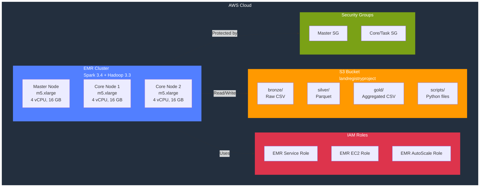

# Terraform Infrastructure for Land Registry Analysis

This directory contains Terraform configuration for provisioning AWS infrastructure to process UK Land Registry data using EMR and Spark.

## Architecture



## Resources Created

### Core Infrastructure
- **S3 Bucket**: Data storage with versioning and encryption
- **EMR Cluster**: Spark cluster for data processing
- **IAM Roles**: Service role, EC2 role, and auto-scaling role
- **Security Groups**: Network security for master and core nodes

### IAM Roles Explained

EMR requires three distinct IAM roles, each serving a specific purpose:

#### 1. EMR Service Role (`emr-land-registry-service-role`)
**Purpose**: Allows the EMR service itself to manage cluster resources on your behalf.

**What it does**:
- Provisions and terminates EC2 instances for the cluster
- Configures security groups and network settings
- Manages cluster lifecycle (start, stop, resize)
- Monitors cluster health and performance

**Permissions**:
- Uses AWS managed policy: `AmazonElasticMapReduceRole`
- Can create/modify EC2 instances, security groups, and EBS volumes
- Can access CloudWatch for monitoring

**Trust relationship**: Only the `elasticmapreduce.amazonaws.com` service can assume this role.

#### 2. EMR EC2 Instance Role (`emr-land-registry-ec2-role`)
**Purpose**: Grants permissions to the EC2 instances (master and core nodes) running in your cluster.

**What it does**:
- Allows Spark jobs to read/write data to S3
- Enables applications running on the cluster to access AWS services
- Streams logs to CloudWatch for debugging
- Executes your PySpark scripts with appropriate permissions

**Permissions**:
- Uses AWS managed policy: `AmazonElasticMapReduceforEC2Role`
- Custom S3 policy for your data bucket:
  - `s3:GetObject` - Read files from S3
  - `s3:PutObject` - Write results to S3
  - `s3:DeleteObject` - Clean up temporary files
  - `s3:ListBucket` - List bucket contents
- CloudWatch Logs access for log streaming

**Trust relationship**: Only EC2 instances can assume this role (via instance profile).

**Note**: This is the role your Spark jobs run under - it needs access to your data!

#### 3. EMR Auto Scaling Role (`emr-land-registry-autoscaling-role`)
**Purpose**: Enables automatic scaling of core and task nodes based on workload.

**What it does**:
- Monitors cluster metrics (CPU, memory, pending tasks)
- Adds nodes when workload increases
- Removes nodes when workload decreases
- Optimizes costs by scaling down during idle periods

**Permissions**:
- Uses AWS managed policy: `AmazonElasticMapReduceforAutoScalingRole`
- Can modify EMR cluster capacity
- Can read CloudWatch metrics to make scaling decisions

**Trust relationship**: Both `elasticmapreduce.amazonaws.com` and `application-autoscaling.amazonaws.com` can assume this role.

**Note**: Only used if you enable auto-scaling in your cluster configuration.

### Default Configuration
- **Region**: eu-west-2 (London)
- **EMR Version**: 6.15.0 (Spark 3.4, Hadoop 3.3)
- **Master Node**: 1x m5.xlarge (4 vCPU, 16 GB RAM)
- **Core Nodes**: 2x m5.xlarge (4 vCPU, 16 GB RAM each)
- **Total Capacity**: 12 vCPU, 48 GB RAM

## Quick Start

### 1. Prerequisites

```bash
# Install Terraform
brew install terraform  # macOS
# or download from https://www.terraform.io/downloads

# Verify installation
terraform version

# Configure AWS CLI
aws configure
```

### 2. Configure Variables

```bash
# Copy example configuration
cp terraform.tfvars.example terraform.tfvars

# Edit with your settings
nano terraform.tfvars
```

### 3. Initialize Terraform

```bash
cd terraform
terraform init
```

### 4. Review Plan

```bash
# See what will be created
terraform plan
```

### 5. Create Infrastructure

```bash
# Create all resources
terraform apply

# Review the plan and type 'yes' to confirm
```

### 6. Get Cluster Information

```bash
# Get cluster ID
terraform output emr_cluster_id

# Get all outputs
terraform output

# Get specific output
terraform output -raw emr_cluster_id
```

## File Structure

```
terraform/
├── main.tf                    # Main configuration and EMR cluster
├── iam.tf                     # IAM roles and policies
├── security_groups.tf         # Security groups for EMR
├── variables.tf               # Variable definitions
├── outputs.tf                 # Output values
├── terraform.tfvars.example   # Example configuration
└── README.md                  # This file
```

## Usage Examples

### Run Ingestion Script

```bash
# Get cluster ID
CLUSTER_ID=$(terraform output -raw emr_cluster_id)

# Run ingestion
../scripts/run_on_emr.sh land_registry_ingestion.py $CLUSTER_ID
```

## Maintenance

### Destroy Infrastructure

```bash
# WARNING: This will delete all resources
terraform destroy

# Type 'yes' to confirm
```

### View State

```bash
# List all resources
terraform state list

# Show specific resource
terraform state show aws_emr_cluster.land_registry
```

## Troubleshooting

### Issue: "Error creating EMR cluster"

**Solution**: Check IAM roles exist and have correct permissions
```bash
aws iam get-role --role-name emr-land-registry-service-role
aws iam get-role --role-name emr-land-registry-ec2-role
```

### Issue: "Cluster stuck in STARTING state"

**Solution**: Check CloudWatch logs or EMR console for details
```bash
aws emr describe-cluster --cluster-id j-XXXXXXXXXXXXX
```

## Security Best Practices

1. **Never commit terraform.tfvars** - Contains sensitive configuration
2. **Use least privilege IAM policies** - Only grant necessary permissions
3. **Enable termination protection** - For production clusters
4. **Restrict SSH access** - Only from your IP address
5. **Enable S3 encryption** - Already configured by default
6. **Use VPC endpoints** - For better security (optional)

## Cost Monitoring

```bash
# Estimate monthly cost
# 2x m5.xlarge core + 1x m5.xlarge master = ~$450/month (24/7)
# With auto-termination after 8 hours/day = ~$150/month

# Check current cluster cost
aws ce get-cost-and-usage \
  --time-period Start=2024-03-01,End=2024-03-24 \
  --granularity MONTHLY \
  --metrics BlendedCost \
  --filter file://emr-filter.json
```

## Additional Resources

- [AWS EMR Documentation](https://docs.aws.amazon.com/emr/)
- [Terraform AWS Provider](https://registry.terraform.io/providers/hashicorp/aws/latest/docs)
- [EMR Best Practices](https://docs.aws.amazon.com/emr/latest/ManagementGuide/emr-plan.html)

